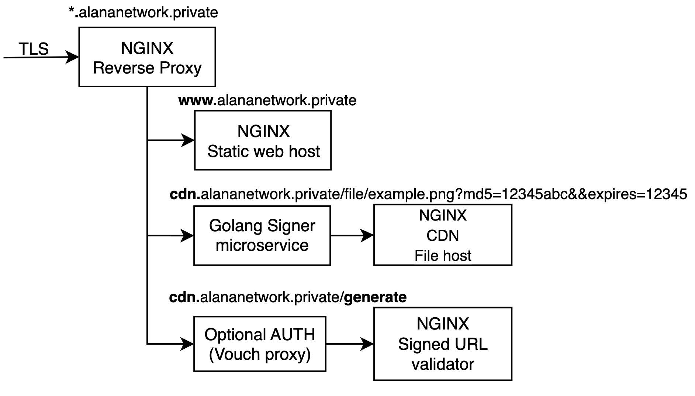

# Alana Network nginx-hosting-signed-cdn-node

This is a multi service node configuration to allow any Alana Network user to run a node to share a webpage or an edge CDN with pre-signed key access.

<p align="center" >

</p>

## Example system architectures and automated deployments

- Single node with docker compose


  ```sh
  #1. Create a local TLS certificate (will be used the network CA when available):
  openssl req -x509 -nodes -days 365 -subj  "/C=XX/ST=XX/O=Alana Inc/CN=*.alananetwork.private" -newkey rsa:2048 -keyout "alananetwork.private.key" -out "alananetwork.private.crt"
  #2. Modify the nginx files as you need.
  #3. Create a .env file in the root folder and add yoour signing key if you need it: KEY="xxxx"
  #3. Deploy locally using docker compose:
  make run
  ```

### AWS HA and fault tolerant with ECS/EC2

TODO (WIP)

### Kubernetes and EKS

TODO (WIP)

